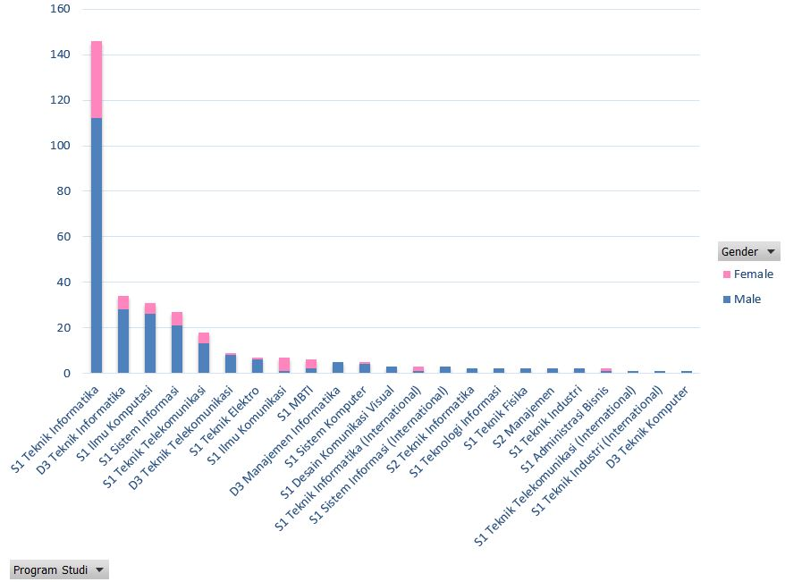
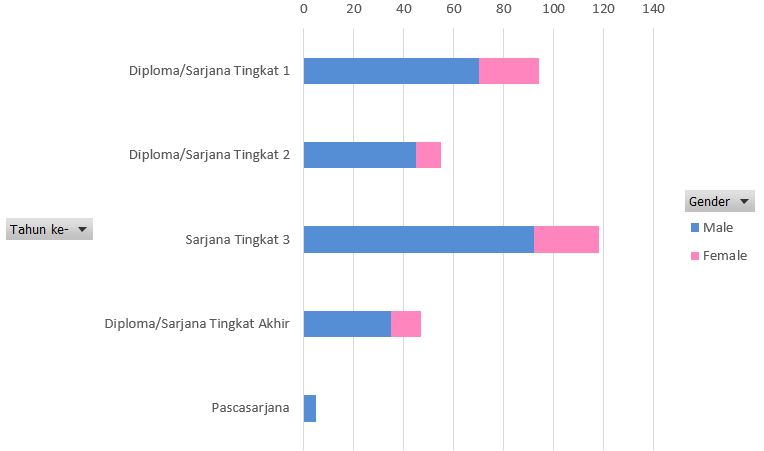
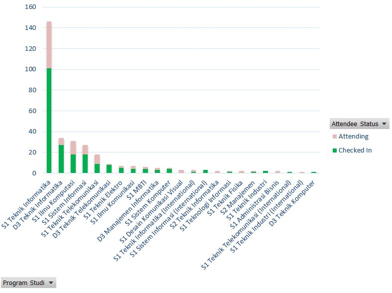
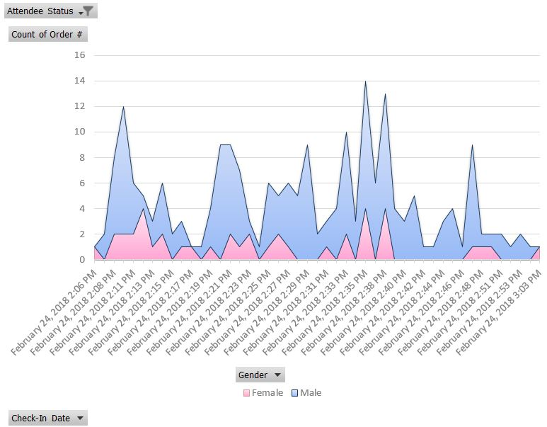

# Behind The Scenes

Dokumen ini dibuat sebagai dokumentasi dan evaluasi pelaksaan program Coaching itu sendiri.
Harapannya, dapat dijadikan pedoman dan perbaikan untuk program-program angkatan selanjutnya dan yang diselenggarakan oleh berbagai kampus lain.

## Timeline: Sosialisasi Awal, Meet & Greet

**Kamis sore, 15 Februari 2018:** Hendy Irawan menemui Kaprodi S1 Teknik Informatika Bapak Said Al Faraby untuk menggagas program Coaching Google Summer of Code & Kerja Praktik 2018. Awalnya juga memasukkan Microsoft Imagine, namun karena deadline terlalu mepet maka hanya GSoC yang dimasukkan untuk saat ini. Pak Said secara umum setuju dengan konsep programnya, dan akan membantu menyambungkan dengan bagian Kemahasiswaan S1IF dan meminta approval Wadek I (Pak Suyanto) untuk usulan GSoC dianggap sebagai KP. Target awal 10-20 mahasiswa, sangat bagus sekali bila sampai 40 mahasiswa.

**Jumat, 15 Februari 2018:** Hendy melakukan survei ke beberapa mahasiswa untuk menentukan jadwal yang kira-kira pas untuk acara sosialisasi. Dari hasil survei dipilihlah hari Sabtu pukul 14:30-15:30, tanggal tentatif (antara 24 Feb 2018 atau 3 Maret 2018 tergantung respons mahasiswa).

**Minggu, 18 Februari 2018:** Pak Said mengabari bahwa Pak Wadek I setuju bahwa GSoC dapat dianggap KP. Perlu didetailkan mekanismenya. Satrio Adi Prabowo bersedia jadi ascoach ke-1. LINE Group Coaching dibuat dengan anggota group Hendy dan mas Satrio (kenapa? cek bagian "Program Design Decisions"). Pak Dody Qori Utama bersedia menjadi coach.

**Senin sore, 19 Februari 2018:** Hendy dan Pak Said bertemu Pak Indra Lukmana Sardi (Kemahasiswaan S1 IF) mengajukan draft proposal program. Secara informal Pak Indra setuju, dan akan dibantu untuk sosialisasi (via LINE channel LAAK S1IF dan Facebook HIC), gedung, konsumsi, perizinan, dan fee pembicara external yaitu John Mark Vandenberg. Bu Ade Romadhony bersedia menjadi coach.

**Selasa sore, 20 Februari 2018:** Hendy mengirimkan draft flyer sosialisasi awal, dan setelah revisi dari Pak Said (istilah yang awalnya terlalu teknis, kekhawatirannya mahasiswa takut duluan, direvisi menjadi lebih _friendly_) maka disebarkan oleh Pak Indra melalui LINE LAAK S1IF dan Facebook HIC. Hari ini ada sekitar 100 mahasiswa yang join. Wisnu Adi Nurcahyo bersedia jadi ascoach ke-2.

**Rabu, 21 Feb 2018:** Hendy mengabari Pak Indra & Pak Said, bahwa jumlah anggota LINE group sudah mendekati 200 sehingga sudah bisa merencanakan acara Meet & Greet yang offline. Pak Said setuju, kita bisa pakai gedung E, kapasitas 100 orang. Pak Indra setuju, dan saya dipersilakan menginvite John.

**Rabu malam, 21 Feb 2018:** John confirmed dapat hadir untuk Sabtu 24 Feb 2018 14:30-15:30. 

**Kamis, 22 Feb 2018:** Pak Indra confirmed venue adalah Gedung Damar (K) dengan kapasitas 300 orang. Malamnya: Flyer untuk acara Meet & Greet disebarkan. Dalam 2 jam, sekitar 50 mahasiswa mendaftar. Yana Agun Siswanto bersedia jadi ascoach ke-3. Pembagian ascoach untuk kepanitiaan Meet & Greet:

* Yana: Dokumentasi (fotografi), artikel bahasa Indonesia (untuk Kemahasiswaan dan FAST), artikel English (untuk Google)
* Wisnu: Konsumsi lunch & snack bagi pemateri, ascoach, dan CS
* Satrio: Perlengkapan, meja registrasi

**Jumat, 23 Feb 2018:** Flyer Meet & Greet disebarkan melalui LINE group LAAK S1IF. Febry Ghaisani confirmed sebagai ascoach ke-4, sekaligus panitia Meet & Greet sebagai MC. Febry mengusulkan satu lagi MC, namun perkembangan selanjutnya temannya berhalangan hadir.

**Jumat sore, 23 Feb 2018:** Hendy menyiapkan form pendaftaran menggunakan Google Forms, template issue GitHub, dan halaman registrasi di website gsocindonesia.github.io. Mas Wisnu sudah mengambil dana dari Bu Ami, namun besok sibuk kuliah sehingga tidak bisa menangani konsumsi. Hendy menyarankan mas Wisnu dan mas Satrio tukar responsibility.  Sehingga pembagian ascoach untuk kepanitiaan Meet & Greet:

* Yana: Dokumentasi (fotografi), artikel bahasa Indonesia (untuk Kemahasiswaan dan FAST), artikel English (untuk Google), penunjuk kursi bagi peserta yang baru datang
* Wisnu: Perlengkapan, meja registrasi
* Satrio: Konsumsi lunch & snack, pembantu meja registrasi
* Febry: MC, pembantu meja registrasi

**Sabtu siang, 24 Feb 2018:** LINE group berisi ~480 mahasiswa + coaches/tim panitia. 319 mahasiswa mendaftar acara Meet&Greet, 211 mahasiswa hadir. Sekitar 50% yang hadir datang on-time dan sisanya datang mulai 14:30 hingga 15:00. Acara dimulai tepat 14:30, dibuka oleh Pak Said, dan "berakhir" pukul 15:35. Dilanjutkan dengan sesi QA hingga pukul 16:30.

**Sabtu sore, 24 Feb 2018:** Halaman registrasi coaching diumumkan: https://gsocindonesia.github.io/reg

## Timeline: Pendaftaran Coaching

**Minggu, 25 Feb 2018:** Mas Wisnu melaporkan bahwa Bu Ami meminta daftar ascoach yang lengkap. Hendy meminta Mas Wisnu untuk segera mengisi 6 slot yang tersisa dari 10 slot yang sudah dianggarkan. Ketua ProClub, Afnizar Nur Ghifari bersedia jadi ascoach ke-5.

**Senin, 26 Feb 2018:** Sayid Muhamad Ridho Fadilah dan Iqbal Basyar bersedia jadi ascoach ke-6 dan ke-7. 32 mahasiswa mendaftar sampai tahap Google Forms, 18 peserta sudah sampai tahap [GitHub Issue](https://github.com/gsocindonesia/coaching2018/issues?q=is%3Aopen+is%3Aissue).

**Selasa, 27 Feb 2018:** Pak Indra sudah ditagih oleh bagian Keuangan, nama 10 ascoach harus sudah fix besok. Per 20:28, pendaftar coaching ada 45 mahasiswa, dan 28 mahasiswa sudah membuat GitHub issue. Novelty Octaviani Faomasi Daeli, Vina Fadriani Effendi, dan Kartini Nurfalah bersedia jadi ascoach. 

**Rabu, 28 Feb 2018:** Hendy mengajukan revisi RAB Coaching ke Pak Indra, yang awalnya 4 sesi coaching menjadi 8 sesi coaching (3 Mar, 10 Mar, 17 Mar, 24 Mar, 31 Mar, 7 Apr, 14 Apr, 21 Apr). Proyeksi RAB yang dibutuhkan di luar coach dan ascoach adalah snack untuk 8 sesi x 100 peserta (max). Pak Indra konfirmasi dulu dengan Pak Said. Mas Wisnu menyerahkan daftar nama dan kelengkapan administrasi 10 ascoach ke Bu Ami (Kemahasiswaan S1IF).

   * Melakukan pemetaan ketersediaan jadwal masing-masing ascoach termasuk Hendy sendiri untuk next offline session (Sabtu 3 Maret 2018 14:30-15:30 tentatif).

## Timeline: Coaching Pre-Acceptance

**Sabtu, 3 Maret 2018:** 67 peserta mendaftar Eventbrite, yang hadir 54 peserta. Sampai malam, pendaftar coaching sebanyak 92 mahasiswa. Rasio ascoach:peserta ~ 1:9.

**Minggu, 4 Maret 2018:** Pendaftar coaching sebanyak 99 mahasiswa.

**Selasa, 27 Maret 2018:** Total 18 mahasiswa Telkom University peserta coaching yang submit proposal Google Summer of Code sebelum deadline pukul 23:00 WIB:

1. [**Wisnu Adi Nurcahyo** (@wisn)](https://github.com/wisn) - [2 proposals](https://github.com/gsocindonesia/coaching2018/issues/3)
2. [**Ganesha Danu Enastika** (@BlinfoldKing)](https://github.com/BlinfoldKing) - [2 proposals](https://github.com/gsocindonesia/coaching2018/issues/13)
3. [**Ravi Mahfunda** (@ravimahfunda)](https://github.com/ravimahfunda) - [1 proposal](https://github.com/gsocindonesia/coaching2018/issues/31)
4. [**William Sungkar** (@rokysungkar)](https://github.com/rokysungkar) - [2 proposals](https://github.com/gsocindonesia/coaching2018/issues/37)
5. [**Dwiferdio Seagal Putra** (@seagalputra)](https://github.com/seagalputra) - [2 proposals](https://github.com/gsocindonesia/coaching2018/issues/15)
6. [**Yana Agun Siswanto** (@bekicot)](https://github.com/bekicot) - [3 proposals](https://github.com/gsocindonesia/coaching2018/issues/8)
7. [**Ilmam Rafidan Hutama** (@ilmamrh)](https://github.com/ilmamrh) - [1 proposal](https://github.com/gsocindonesia/coaching2018/issues/11)
8. [**Novelty Octaviani Faomasi Daeli** (@NoveltyOFD)](https://github.com/NoveltyOFD) - [1 proposal](https://github.com/gsocindonesia/coaching2018/issues/24)
9. [**Ahmad Alfi Adz-Dzikri** (@serabiasin)](https://github.com/serabiasin) - [1 proposal](https://github.com/gsocindonesia/coaching2018/issues/10)
10. [**Muhammad Arief Ismirianda** (@mariefismi02)](https://github.com/mariefismi02) - [1 proposal](https://github.com/gsocindonesia/coaching2018/issues/63)
11. [**Afnizar Nur Ghifari** (@afnizarnur)](https://github.com/afnizarnur) - [1 proposal](https://github.com/gsocindonesia/coaching2018/issues/60)
12. [**Kartini Nurfalah** (@kartininurfalah)](https://github.com/kartininurfalah) - [2 proposals](https://github.com/gsocindonesia/coaching2018/issues/40)
13. [**Satrio Adi Prabowo** (@probeadd)](https://github.com/probeadd) - [1 proposal](https://github.com/gsocindonesia/coaching2018/issues/4)
14. [**Iqbal Basyar** (@underground-11)](https://github.com/underground-11) - [1 proposal](https://github.com/gsocindonesia/coaching2018/issues/55)
15. [**Febry Ghaisani** (@ghaisani)](https://github.com/ghaisani) - [1 proposal](https://github.com/gsocindonesia/coaching2018/issues/27)
16. [**Sayid Muhamad Ridho Fadilah** (@ridhofadilah)](https://github.com/ridhofadilah) - [1 proposal](https://github.com/gsocindonesia/coaching2018/issues/21)
17. [**Vina Fadriani Effendi** (@effendivina)](https://github.com/effendivina) - [1 proposal](https://github.com/gsocindonesia/coaching2018/issues/39)
18. [**Muhammad Valian Masdani** (@vmasdani)](https://github.com/vmasdani) - [1 proposal](https://github.com/gsocindonesia/coaching2018/issues/71)

**Senin, 23 April 2018:** Sebanyak 2 mahasiswa Telkom University peserta coaching lulus seleksi Google Summer of Code 2018, dari total [4 mahasiswa dari Indonesia yang lulus seleksi GSoC 2018](https://docs.google.com/spreadsheets/d/1vFd0_C2HrX5F7-YBhqem6cGB1l418IjgceWW2YY8CMA/edit?usp=sharing):

1. [**Wisnu Adi Nurcahyo** (@wisn)](https://github.com/wisn) - [Haskell.org: Format-Preserving YAML](https://summerofcode.withgoogle.com/projects/#6279427311271936)
2. [**Yana Agun Siswanto** (@bekicot)](https://github.com/bekicot) - [coala: Meta Review Tasks Lists](https://summerofcode.withgoogle.com/projects/#6032346365558784)

2 mahasiswa/i dari Indonesia lainnya yang lulus seleksi GSoC 2018:

* [**Fienny Angelina**](https://www.linkedin.com/in/fienny-angelina-68576697/) - [Digital Impact Alliance: Implement Machine Learning in Tasking Manager Workflow](https://summerofcode.withgoogle.com/projects/#6656841455501312)
* [**Muhammad Iqbal C. Rochman**](https://www.linkedin.com/in/muhiqbalcr/) - [The ns-3 Network Simulator Project: Merging and Improvement of LTE and Wi-Fi Coexistence Module](https://summerofcode.withgoogle.com/projects/#4870409804054528)

## Program Design Decisions

**"Coaching":** Agar terkesan agar keren (_English_) dikit, dibanding "pelatihan" atau "lokakarya" atau "pembinaan", namun juga _friendly_ dan kesannya dekat dengan mahasiswa. Istilah "ascoach" juga mudah disebutkan, dibanding "aslatih" atau "asbina" atau "asloka".

**Menggandeng assistant coach:** Mengurangi beban dosen (yang secara ekonomis nyaris murni relawan 😅), meningkatkan _sense of responsibility_ mahasiswa, dan memberikan insentif bagi mahasiswa untuk berkomitmen dengan program ini, insentif dalam bentuk honor dan lunch juga pengakuan. Asumsi lagi, bahwa mahasiswa akan lebih nyaman berkomunikasi dengan ascoach yang sesama mahasiswa, dibanding dengan dosen.

**Insentif untuk peserta coaching:** Snack selama coaching, dan proyek GSoC dianggap KP. Meski begitu, ternyata peminat dari selain tahun KP juga cukup signifikan.

**LINE Group:** Sebenarnya untuk Google Summer of Code, media yang lebih tepat adalah Telegram, Gitter, atau Slack. Namun, media LINE Group dipilih dengan pertimbangan bahwa mayoritas mahasiswa Telkom University memiliki LINE dan nyaman/familiar dengan LINE. Berkaca dari interaksi [Facebook Group Google Summer of Code Indonesia](https://web.facebook.com/groups/gsoc.indonesia/) yang rendah, maka penggunaan Facebook Group ini di-skip sama sekali (setidaknya pada tahap awal).

## Meet & Greet Stats

### Pendaftar Meet & Greet by Program Studi & Gender

### Pendaftar Meet & Greet by Year

### Pendaftar dan Kehadiran Meet & Greet

### Pendaftar Meet & Greet by Ketepatan Waktu

(Acara dimulai tepat pukul 14:30)

### Pendaftar Meet & Greet by GitHub Account

