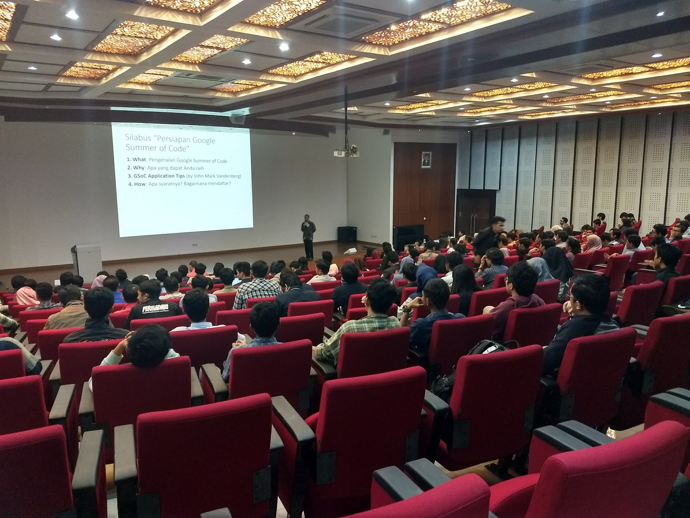
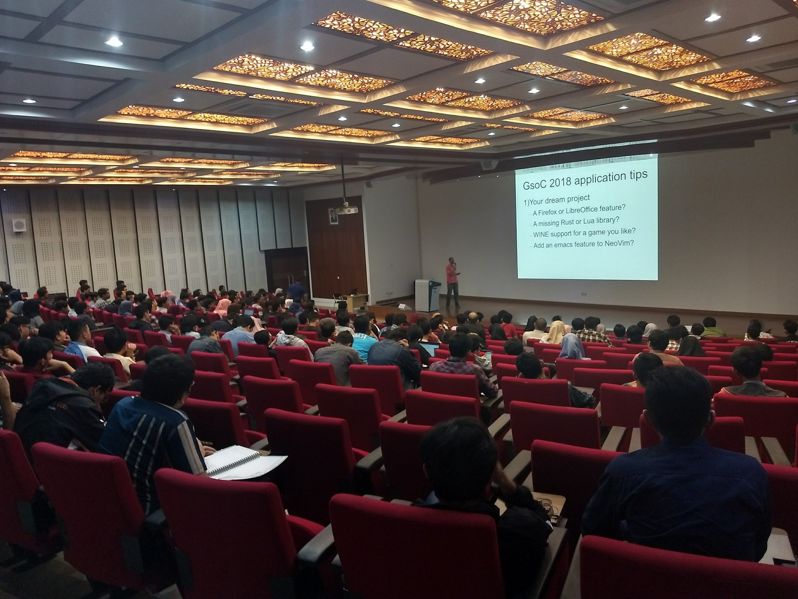

# Telkom University Google Summer of Code 2018 Coaching :  Meet and Greet

*Google Summer of Code* (GSoC) is an annual program that held since 2005 by Google. This program is meant for all students in all degrees who desired to contribute in opensource organization. 

This year, Telkom University welcomed GSoC with Coaching program for its students. This is the first time in Telkom University history to have a formal coaching of GSoC, held by its own lecturers with so much enthusiasm from the students. Especially for students from School Of Computing (all major), this program was inaugurated as one of its legitimate internship summer program.

Knowing that GSoC is an International program from Google, it's not easy for the students to compete in alone against all students around the world. Therefore, we held this coaching program to make sure the students have their place to learn and discuss together, stone by stone, completing the GSoC requirements and prepare them for GSoC. 

This coaching program, anyway, is not a one man job. We have prepared appropriates coach to help you with during the GSoC Coaching Program. They are :
- John Mark Vanderberg (President of Wikimedia Australia)
- Hendy Irawan (GSoC Participant 2015)
- Dody Qori Utama (Lecturer)
- Ade Romadhony (Lecturer)

The first agenda of this coaching program is *Meet and Greet* that held on February 24, 2018 at Gedung Damar (K) Telkom University. There are about 300 students attended this meet and greet with greate enthusiasm in GSoC. The agenda went well,directing them to the next session : 1st Coaching that will be held next week.

## Are You Curious Enough?

Please visit [Coaching Google Summer of Code & Kerja Praktik 2018](https://gsocindonesia.github.io) for more information.

You could also visit [School of Computing Telkom University](http://www.telkomuniversity.ac.id) for School Of Computing's updates.

See You on next session !
