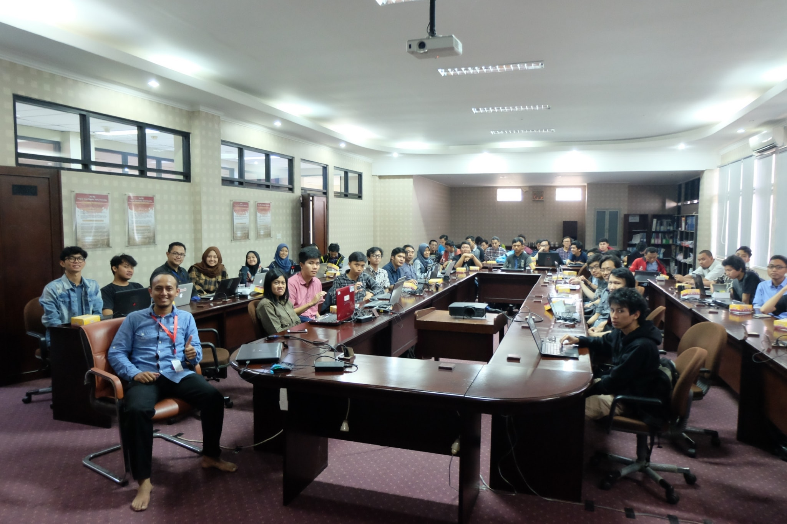
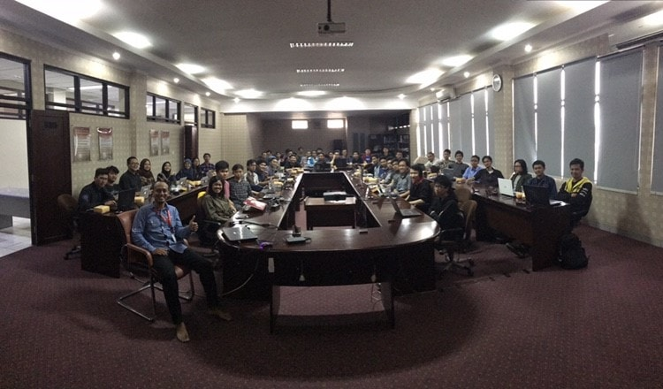

# Sesi 1 Coaching Google Summer of Code & Kerja Praktik 2018

Sesi pertama pada rangkaian kegiatan ini dilakukan pada tanggal 3 Maret 2018 di Gedung D, Telkom University yang dipimpin oleh Bapak Hendy Irawan selaku *coach* dalam kegiatan ini. Selama rangkaian acara *Coaching* ini, *coach* juga akan dibantu oleh pada 10 asisten *coach* dalam membimbing peserta dalam kegiatan ini. Pada sesi pertama pada hari ini, 90 orang peserta yang mendaftar dalam kegiatan Coaching ini akan dibagi menjadi beberapa kelompok yang akan dibimbing oleh 1 asisten coach. Pembagian secara rata dilakukan agar setiap asisten coach memiliki peserta dengan jumlah yang sama. 

Materi yang dibahas pada siang hari ini adalah mengenai penjelasan mengenai pentingnya *issues* yang dibuat pada GitHub Komunitas GSoC Indonesia. Selain itu, pada sesi ini juga ada penjelasan mengenai bagaimana cara memilih organisasi dan ide. 

Pada sesi ini juga, ada beberapa hal yang menjadi tugas untuk sesi selanjut bagi peserta yang hadir maupun yang tidak. Adapun yang menjadi tugas sesi ini adalah:
	1. Memastikan peserta telah membuat GitHub *Issue* 
	2. Memperbaharui GitHub issue para peserta masing-masing
	3. Memilih maksimal 3 organisasi
	4. Memilih *ideas* untuk masing-masing organisasi
	5. Menghubungi mentor 

 

## Ingin Tahu Lebih Lanjut?

Kamu bisa mengunjungi [Coaching Google Summer of Code & Kerja Praktik 2018](https://gsocindonesia.github.io) untuk info lebih lanjut.

Kunjungi juga [School of Computing Telkom University](http://www.telkomuniversity.ac.id) untuk update info-info penting tentang FIF.

Sampai Bertemu di Sesi Coaching selanjutnya!
