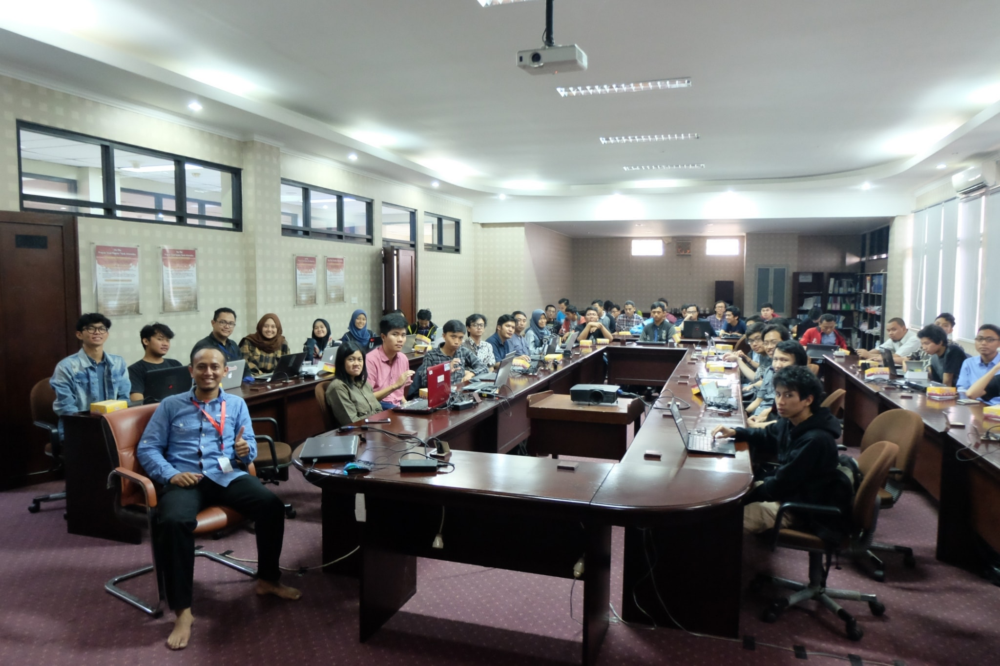
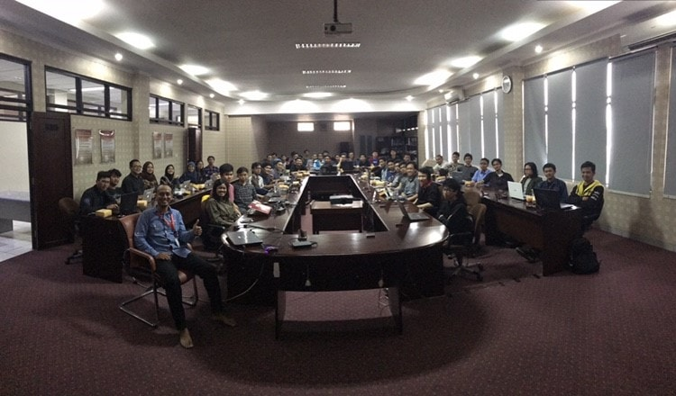

# Google Summer of Code Coaching : Session 1

The first session of the coaching programm was held on March 3rd, 2018 on Gedung D Telkom University. This session led by our beloved coach, Hendy Irawan with helps of his Assistants. There are about 90 students attended this first session of coaching. These students divided into 10 groups with one Assistant to be responsible for each group.

This session explain the importance of *issues* that the students make in GSoC Indonesia Organizaiton. Besides, we show how to choose a proper organization and its idea that suits their capability and will.

This first session went well, and all students have their task to be completed on the next session : 
1. Ensuring themself to have the *issue* on GSoC Indonesia's Github 
2. Updating their issues over time (until the next session)
3. Choosing up to 3 GSoC Organizations
4. Choosing 1 idea for each organizations they choose
5. Contacting the corresponding mentors of the idea

 

## Are You Curious Enough ?

Please visit [Coaching Google Summer of Code & Kerja Praktik 2018](https://gsocindonesia.github.io) for more information.

You could also visit [School of Computing Telkom University](http://www.telkomuniversity.ac.id) for School Of Computing's updates.

See you on the next session!
